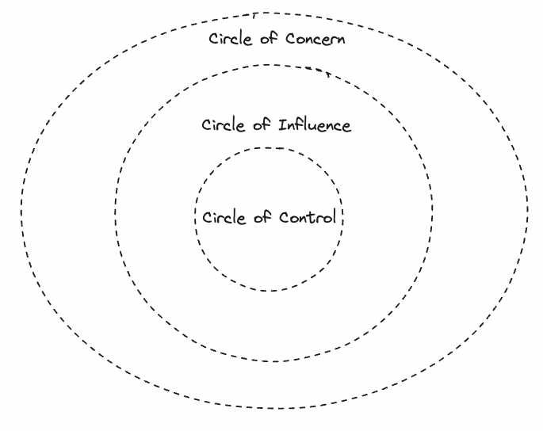
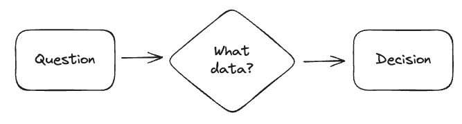
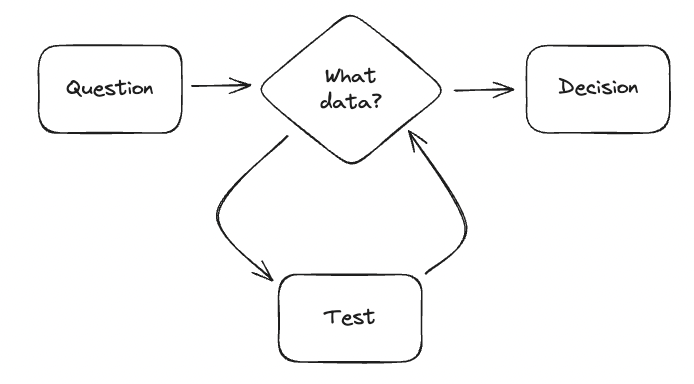

<!-- slide -->

# Codesgiving

<!-- slide -->

## Goals

 

- Practice gratitude together
- Share open-source contribution ideas
- Make an impact

<!-- slide -->

## Context

 

__Thanksgiving__ is a holiday practiced in many countries which focuses on __gratitude for good harvests__ of the preceding year.

<!-- slide -->

## Context

 

This presentation will be about channeling the spirit of Thanksgiving by giving our _thanks_ through _code_.

<!-- slide -->

## Open-source Harvests

 

- What have you harvested from open-source?

<!-- slide -->

## Open-source Harvests

 

[CytoTable](https://github.com/cytomining/CytoTable) dependencies:

- Show Python dependencies of CytoTable and count the number of lines
- `poetry run pip freeze | wc -l`
- `141`

<!-- slide -->

## Open-source Harvests

 

- How can we celebrate open-source harvests?

<!-- slide -->

## Open-source Harvests

 

- Open-source can be an _adjective_, _noun_, or a _verb_.
- Open-source is alive and involves software gardening.

<!-- slide -->

## Open-source Participation

- Influence counts! [Circles of control and influence](https://positivepsychology.com/circles-of-influence/)

<!-- slide -->

## Open-source Participation

 

- Communication matters!

> "Six degrees of separation is the idea that all people are six or fewer social connections away from each other."
- [Six degrees of separation](https://en.wikipedia.org/wiki/Six_degrees_of_separation)

<!-- slide -->

## Open-source Participation

 

- [Data thinking](https://en.wikipedia.org/wiki/Data_thinking)

<!-- slide -->

## Open-source Impact

 

[CPython](https://github.com/python/cpython) example through estimations:

- __Github users__ >= 100,000,000  [GitHub Blog: 100 million developers and counting](https://github.blog/2023-01-25-100-million-developers-and-counting/)
- __Programming languages__  Python entails 17.79% of GitHub Pull Requests   [GitHut 2.0 Programming Languages](https://madnight.github.io/githut/#/pull_requests/2023/3)
- __Potential for impact__  17.79% of 100 million : 17,790,000 people (users as developers)

<!-- slide -->

## Open-source Impact

 

Open issues:

- ~7,000 issues! 
- [https://github.com/python/cpython/issues](https://github.com/python/cpython/issues)

<!-- slide -->

## Open-source Impact

 

> "The Pareto principle states that for many outcomes, roughly 80% of consequences come from 20% of causes (the "vital few")."
- [Pareto principle](https://en.wikipedia.org/wiki/Pareto_principle)

<!-- slide -->

## Open-source Impact

 

Are there "vital few" areas where open-source contributions could help?

<!-- slide -->

## Python Example

 

Python `sqlite3` and context managers.

1. Saw feedback about closing `sqlite3` connections.
1. [Try to open feature request](https://github.com/python/cpython/issues) (issues indicate to open discussion first)
1. [Opened discussion](https://discuss.python.org/t/implicitly-close-sqlite3-connections-with-context-managers/33320)
1. [Submitted issue](https://github.com/python/cpython/issues/109234)
1. [Fix related to issue](https://github.com/python/cpython/pull/110294/files)

<!-- slide -->

## Python Example

 

How much will it help?
- Created public discussion content
- Added public issue documentation
- Resulted in public-facing documentation updates
- Influences developer practices upstream?

<!-- slide -->

## CellProfiler

  

<!-- slide -->

## CellProfiler

 

- [@jenna-tomkinson](https://github.com/jenna-tomkinson) helped communicate issues with Conda environments.
- Anecdotally I had witnessed these too, but didn't know how much this might effect the community or whether the issue still existed on my device.

<!-- slide -->

## CellProfiler Impacts

 

We can use GitHub, PyPI, and bibliometrics for understanding the impact metrics:

- __GitHub stars__: 817 ([link](https://star-history.com/#cellprofiler/cellprofiler&Date))
- __PyPI downloads__: 491 ([link](https://github.com/ofek/pypinfo))

<!-- slide -->

## CellProfiler Impacts

 

- __Google Scholar results__: 15,600 results ([link](https://scholar.google.com/scholar?as_sdt=0,6&q=%22cellprofiler%22&hl=en))
- __BioRxiv results__: 1,801 results ([link](https://www.biorxiv.org/search/cellprofiler))
- __Estimate__: 16,000 articles since 2005 ([initial CellProfiler release](https://en.wikipedia.org/wiki/CellProfiler#History)) = 888 articles per year  
- __Potential for impact__: about 500 research software engineers (or projects?) and 900 new articles per year

<!-- slide -->

## CellProfiler Impacts

 

Open issues: 

- ~270 issues ([total issues link](https://github.com/cellprofiler/cellprofiler/issues))
- __Targeted search__: 11 open issues, 48 closed issues ([issues search link](https://github.com/CellProfiler/CellProfiler/issues?q=is%3Aissue+is%3Aopen+conda+environment))

<!-- slide -->

## CellProfiler Exploration

 

- How can we try to communicate, influence, or fix this challenge?

<!-- slide -->

## CellProfiler Exploration

 

- [Test driven development](https://en.wikipedia.org/wiki/Test-driven_development)
<!-- slide -->

## CellProfiler Exploration

 

Troubleshooting process:

1. Verify challenge
2. Develop solution
3. Test solution

<!-- slide -->

## CellProfiler Exploration

 

- Forked the repository with intent to verify
- [Fork branch link](https://github.com/d33bs/CellProfiler/tree/test-driven-conda-environments)

<!-- slide -->

## CellProfiler Exploration

 

- Test many platforms in a reproducible container each push during development
- This makes every push a kind of hypothesis test about a fix
- [GitHub Actions matrix strategy](https://github.com/d33bs/CellProfiler/blob/test-driven-conda-environments/.github/workflows/test-conda.yml#L13)
- [GitHub Actions implementation](https://github.com/d33bs/CellProfiler/actions)

<!-- slide -->

## CellProfiler Exploration

 

Troubleshooting process:

1. ✅ Verify challenge
2. Develop solution
3. Test solution

<!-- slide -->

## CellProfiler Participation

 

More participation to come!

<!-- slide -->

## Closing Thought

 

- "You know more than you can say."   ([from a Radiolab episode](https://radiolab.org/podcast/cataclysm-sentence/transcript))

- What would you choose to give to the future?

<!-- slide -->

## Gratitude

 

Thank you all for who you are and what you give.

__Happy Thanksgiving!__
