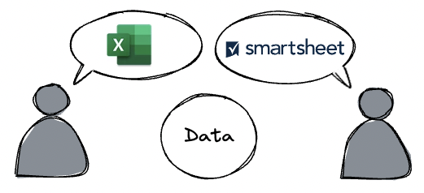
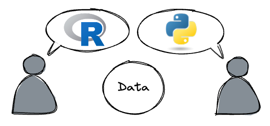
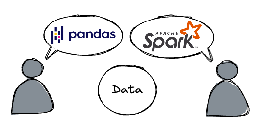
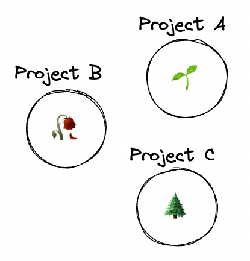

## Brief Introduction

 

👋🤓 Hi, I'm Dave

 

University of Colorado Anschutz Medical Campus 
Department of Biomedical Informatics 
Software Engineering Team

---

## Presentation Outline

 

1. ✍️ Data Literacy and Software Diversity
1. 📚 Apache Arrow
1. ⏯️ Demonstrations

---

## Data Literacy

 

Data Literacy ([Wikipedia](https://en.wikipedia.org/wiki/Data_literacy))

> _"Data literacy is the ability to read, understand, create, and communicate data as information."_

---

## Data Literacy

 

How we might imagine data conversations.

---

## Data Literacy

 

The spreadsheets should be the same, right?

---

## Data Literacy

 

What is data, ___really___?

 

- What is a table?
- What is a schema?
- What is a dataframe?

---

## Data Literacy

 

We can develop our way around this!

---

## Data Literacy

 

Maybe it gets better if we choose one language?

---

## Data Literacy

 

They're all just dataframes, right?

---

## Data Literacy

 

- Which data approach is more _"correct"_?
- Is this a false dilemma?

---

## Software Diversity

 

🪴 __Software gardening:__

A practice of growing and cultivating software using parallels from horticulture.

---

## Software Diversity

 

Software tends to follow patterns from life.

---

## Apache Arrow

 

 
Apache Arrow is a library for managing data across many languages. ([https://arrow.apache.org](https://arrow.apache.org/))

---

## Background
