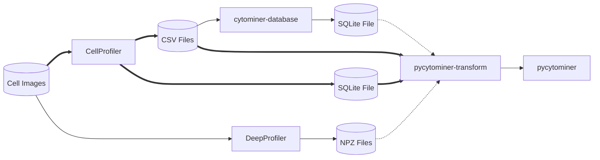
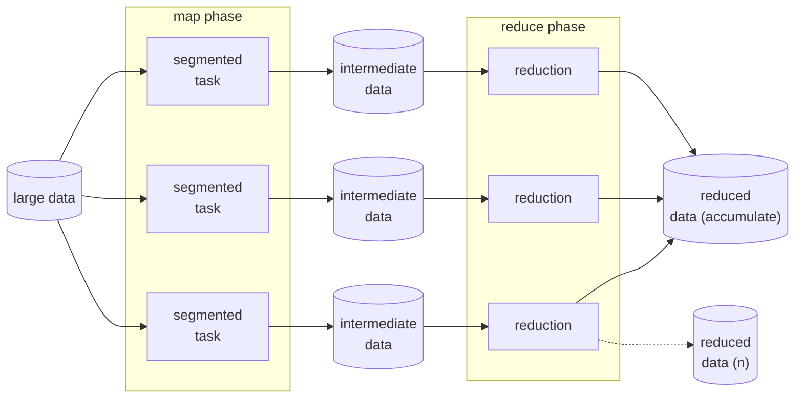
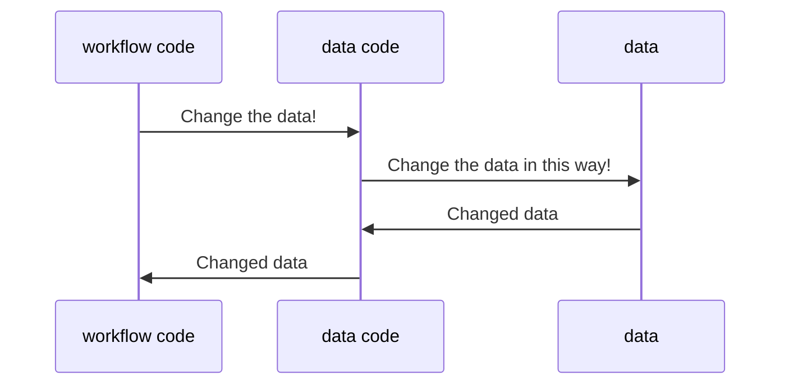

<!-- slide -->

### <span style="color:#777; text-align:center;">Way Lab: Research in Progress

### <span style="color:#222; text-align:center;font-weight:bold">pycytominer-transform</span>

<!-- slide -->

### Presentation Outline

<br>

1. ✅ Overview
1. 🛣️ Points of Interest
    - ⚙️ MapReduce influence
    - :books: Data grammar

<!-- slide -->

### Overview &bull; What?

<br>

<span style="font-size:.9em">`🛠️ pycytominer-transform` is a solution to <br> data _scalability_ and _compatibility_ challenges  <br> with large cell morphology feature datasets.</span>

<!-- slide -->

### Overview &bull; What?

<br>



<br>

[https://cytomining.github.io/pycytominer-transform/](https://cytomining.github.io/pycytominer-transform/)

<!-- slide -->

### Overview &bull; How?

Quick implementation details:

- 🐍 Python 3.8 - 3.9
- 📝 [Prefect](https://docs.prefect.io/) workflows
- 🗃️ [Arrow](https://arrow.apache.org/docs/index.html) core data format
- 🤸 [DuckDB](https://duckdb.org/docs/sql/introduction) data gymnastics

<!-- slide -->

### Overview &bull; How?

Quick auxiliary details:

- 🐍 [Poetry](https://python-poetry.org/docs/) environments
- ✅ [Pre-commit](https://pre-commit.com/) checks
- 🎛️ [Dagger](https://docs.dagger.io/) continuous testing
- 📖 [Myst](https://myst-parser.readthedocs.io/en/latest/) for docs over `.md`

<!-- slide -->
### Overview &bull; Why?

<br>

- Cell morphology datasets are large.
- Data transformation is needed.
- [`pandas`](https://pandas.pydata.org/) doesn't scale well.
- CSV's and SQLite don't scale well.

<!-- slide -->
### MapReduce Influence

<br>

[Prefect](https://docs.prefect.io/) provides a "map" capability
leveraged in workflows for parallelism.

<!-- slide -->
### MapReduce Influence

<br>

Google Research:
__[MapReduce: Simplified Data <br> Processing on Large Clusters](https://research.google/pubs/pub62/)__

_"MapReduce is a programming model and an
associated implementation for processing and
 generating large data sets."_

<!-- slide -->
### MapReduce Influence



<br>

<!-- slide -->
### MapReduce Influence

<br>

`pycytominer-transform` leverages
multiple maps to parallelize data extract,
transform, and reduction (accumulation).

<!-- slide -->
### Data Grammar

<br>
What is a data "join"?

<!-- slide -->
### Data Grammar?


<span style="font-size:.8em;">_[Link: ARROW-18246](https://issues.apache.org/jira/browse/ARROW-18246)_</span>

How do we talk about data pro<span style="font-style:italic;">gramm[ar]ing</span>?

<!-- slide -->
### Data Grammar

<br>

Have we done a good job protecting
against software decay for data code?

<!-- slide -->
### Data Grammar &bull; Some Translations

<br>

`words` + `syntax` = `meaning`

`data` + `instructions` = `result`

<!-- slide -->

### Data Grammar &bull; Layers

<br>



<br>

<!-- slide -->

### Data Grammar &bull; Examples

Example input
<table>
<tr>
<td >

<table>
<thead>
<tr style="border:1px solid grey;">
<th>id</th>
<th>data1</th>
</tr>
</thead>
<tbody>
<tr style="border:1px solid grey;">
<td>1</td>
<td>a</td>
</tr>
<tr style="border:1px solid grey;">
<td>2</td>
<td>b</td>
</tr>
<tr style="border:1px solid grey;">
<td>3</td>
<td>c</td>
</tr>
</tbody>
</table>

</td>
<td>

<table>
<thead>
<tr style="border:1px solid grey;">
<th>id</th>
<th>data2</th>
</tr>
</thead>
<tbody>
<tr style="border:1px solid grey;">
<td>1</td>
<td>d</td>
</tr>
<tr style="border:1px solid grey;">
<td>2</td>
<td>e</td>
</tr>
<tr style="border:1px solid grey;">
<td>3</td>
<td>f</td>
</tr>
</tbody>
</table>

</td>
</tr>
</table>

<!-- slide -->

### Data Grammar &bull; Examples

Example output

<table>
<thead>
<tr style="border:1px solid grey;">
<th>id</th>
<th>data1</th>
<th>data2</th>
</tr>
</thead>
<tbody>
<tr style="border:1px solid grey;">
<td>1</td>
<td>a</td>
<td>d</td>
</tr>
<tr style="border:1px solid grey;">
<td>2</td>
<td>b</td>
<td>e</td>
</tr>
<tr style="border:1px solid grey;">
<td>3</td>
<td>c</td>
<td>f</td>
</tr>
</tbody>
</table>

<!-- slide -->

### Data Grammar &bull; Examples

<br>

```python
# native python "join"
dataset_a = {"id":[1, 2, 3], "data1": ["a","b","c"]}
dataset_b = {"id":[1, 2, 3], "data2": ["d","e","f"]}

dataset_c = dataset_a.copy()
dataset_c.update(dataset_b)

print(dataset_c)
# {
#   'id': [1, 2, 3], 
#   'data1': ['a', 'b', 'c'], 
#   'data2': ['d', 'e', 'f']
# }
```

<br>

<!-- slide -->

### Data Grammar &bull; Examples

<br>

```python
# pandas merge to achieve a join
import pandas as pd

dataset_a = pd.DataFrame(
    {"id": [1, 2, 3], "data1": ["a", "b", "c"]},
)
dataset_b = pd.DataFrame(
    {"id": [1, 2, 3], "data2": ["d", "e", "f"]},
)

dataset_a.merge(
    dataset_b,
    on="id",
).to_dict(orient="list")
```

<br>

<!-- slide -->

### Data Grammar &bull; Examples

<br>

```python
# pandas merge
import pandas as pd

dataset_a = pd.DataFrame(
    {"id": [1, 2, 3], "data1": ["a", "b", "c"]},
)
dataset_b = pd.DataFrame(
    {"id": [1, 2, 3], "data2": ["d", "e", "f"]},
)

dataset_a.merge(
    dataset_b,
    on="id",
).to_dict(orient="list")
```

<br>

<!-- slide -->

### Data Grammar &bull; Examples

<br>

```python
# pyarrow join
import pyarrow as pa

dataset_a = pa.Table.from_pydict(
    {"id": [1, 2, 3], "data1": ["a", "b", "c"]},
)
dataset_b = pa.Table.from_pydict(
    {"id": [1, 2, 3], "data2": ["d", "e", "f"]},
)

dataset_a.join(
    dataset_b,
    keys="id",
).to_pydict()
```

<br>

<!-- slide -->

### Data Grammar &bull; Decay

<br>

- We've repeated ourselves _and_
- Used inconsistent keywords _and_
- May witness different results.

<!-- slide -->

### Data Grammar &bull; SQL

<br>

[SQL](https://en.wikipedia.org/wiki/SQL) was created 49 years ago to
enable code-based data operations.

SQL provides one way to isolate
and understand data grammar.

<!-- slide -->

### Data Grammar &bull; DuckDB SQL

<br>

`Arrow` + `DuckDB SQL` = `result`

<!-- slide -->

### Data Grammar &bull; DuckDB SQL

<span style="font-size:.7em">

```python
import duckdb
import pandas as pd

dataset_a = pd.DataFrame(
    {"id": [1, 2, 3], "data1": ["a", "b", "c"]},
)
dataset_b = pd.DataFrame(
    {"id": [1, 2, 3], "data2": ["d", "e", "f"]},
)

joined_result = (
    duckdb.connect()
    .execute(
        f"""
    SELECT 
        dataset_a.id,
        dataset_a.data1,
        dataset_b.data2,
    FROM dataset_a
    LEFT JOIN dataset_b ON
        dataset_a.id = dataset_b.id
    """
    )
    .arrow()
)
joined_result
```

</span>

<!-- slide -->

### Data Grammar &bull; DuckDB SQL

<span style="font-size:.7em">

```python
import duckdb
import pyarrow as pa

dataset_a = pa.Table.from_pydict(
    {"id": [1, 2, 3], "data1": ["a", "b", "c"]},
)
dataset_b = pa.Table.from_pydict(
    {"id": [1, 2, 3], "data2": ["d", "e", "f"]},
)

joined_result = (
    duckdb.connect()
    .execute(
        f"""
    SELECT
        dataset_a.id,
        dataset_a.data1,
        dataset_b.data2,
    FROM dataset_a
    LEFT JOIN dataset_b ON
        dataset_a.id = dataset_b.id
    """
    )
    .arrow()
)
```

</span>

<!-- slide -->

### Data Grammar &bull; DuckDB SQL

<br>

Creating data grammar with SQL using
Arrow and DuckDB creates understandable
and performant data code.

<!-- slide -->

### Thank you

<br>

Questions / comments?
