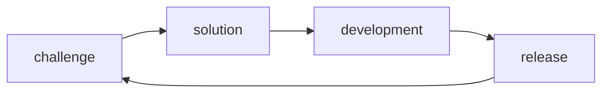
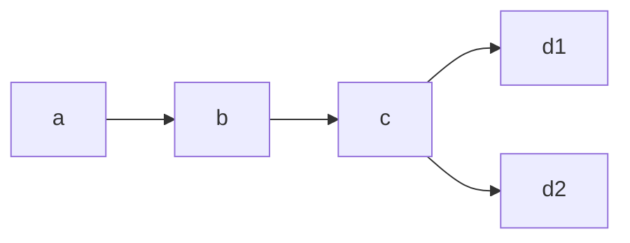
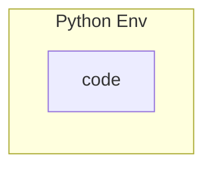
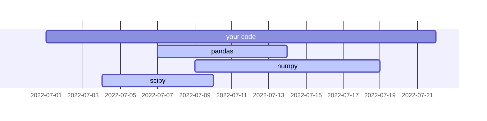
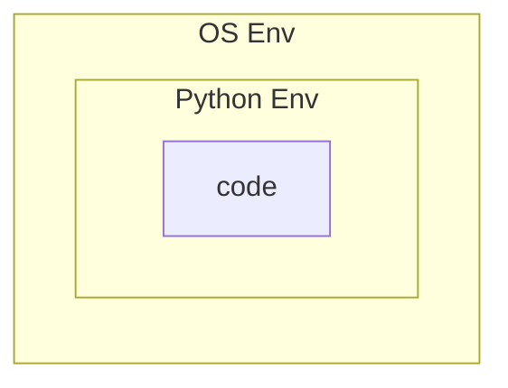
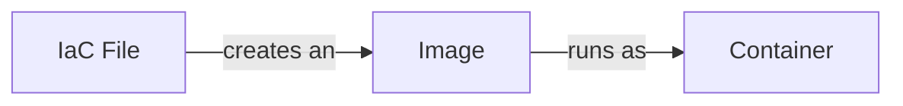
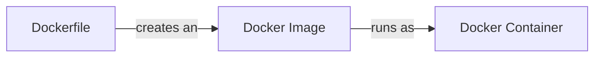

<!-- slide -->

# Surviving <br>Code Decay

### <span style="color:#aaa; text-align:center;">Finding Shelter Amidst <br> Erosion and Time</span>

<!-- slide -->

## Goal

<br>

Discuss code decay and some tools which may help.

- Documentation
- Unused Code
- Environment Hazards

<!-- slide -->

## Why this matters

<br>

- 🧟 Eventually the things you create will decay.
- 🚀 Tools which help avoid decay may also increase your velocity.
- 🧠 Understanding the phenomenon is better than: <br>"this code is bad and you should feel bad too."

<!-- slide -->

## Definition

<br>

"Software rot ... is either a slow deterioration of software quality over time or its diminishing responsiveness that will eventually lead to software becoming faulty, unusable, or in need of upgrade. "

<br>

[Wikipedia: Software Rot](https://en.wikipedia.org/wiki/Software_rot)

<!-- slide -->

## Inspirations


[Project: Memory of Mankind (MOM)](https://en.wikipedia.org/wiki/Memory_of_Mankind)

<!-- slide -->

## Inspirations


[Book: Software Engineering at Google](https://abseil.io/resources/swe-book)

<!-- slide -->

## Inspirations

> "... it has been found that the results of many scientific studies are difficult or impossible to reproduce."

[Metascience: Replication Crisis](https://en.wikipedia.org/wiki/Replication_crisis)

<!-- slide -->
## Code Lifecycle

<br>
<br>

## 🌊 🛶 🌊

## 🌊 🌊 🌊

<!-- slide -->
## Code Lifecycle

<br>
<br>



<!-- slide -->
## Code Lifecycle

<br>

How long do you need your code to live?

- Hours
- Days
- Months
- Years

<!-- slide -->
## Code Lifecycle

<br>

How would someone else see the same results as you?

<!-- slide -->

## Documentation

<br>

Human understanding provides <br> a better chance your code will survive.

<!-- slide -->

## Documentation

<br>

Information decay; How much do we forget? 😵‍💫

<!-- slide -->

## Documentation

<br>
Type hints in code
<br>
<br>

<table>
<tr>
<td>

````python
def example(var):
    return var[0]
````

</td>
<td>

```python
def example(var: list) -> str:
    return var[0]
```

</td>
</tr>
<tr>
<td>No hints</td>
<td>Type hints</td>
</tr>
</table>

<!-- slide -->

## Documentation

<br>

Type hints can be linted using [mypy](http://mypy-lang.org/).
This makes it easier to trace bugs over time.

<br>
<br>

<!-- slide -->

## Documentation

<br>
Diagramming in Markdown
<br>
<br>

<table>
<tr>
<td>

````shell

````

</td>
<td>


</td>
</tr>
<tr>
<td>Mermaid Code</td>
<td>Mermaid Render</td>
</tr>
</table>

<!-- slide -->

## Documentation

<br>

Mermaid can be rendered in Github using codeblocks.
[sphinxcontrib-mermaid](https://github.com/mgaitan/sphinxcontrib-mermaid) can be used to render mermaid in Sphinx docs.

<!-- slide -->

## Documentation

<br>

Many other code-based diagramming tools.

- [PlantUML](https://plantuml.com/) (collection)
- <https://kroki.io/> (collection of others)

<!-- slide -->

## Unused Code

<br>
<br>
It's easier to write code than it is<br> to make sure code is always used.

<!-- slide -->
## Unused Code

<br>
Unused imports
<br>
<br>

<table>
<tr>
<td>

````python
import os
import pathlib
import pandas as pd

df = pd.read_csv("example.csv")
df.head()
````

</td>
<td>

```python
import pandas as pd

df = pd.read_csv("example.csv")
df.head()
```

</td>
</tr>
<tr>
<td>Unused imports</td>
<td>Only what we need</td>
</tr>
</table>

<!-- slide -->
## Unused Code

<br>

[pylint](https://pylint.pycqa.org/en/latest/user_guide/messages/warning/unused-import.html) can lint unused imports.
[nbqa](https://nbqa.readthedocs.io/en/latest/examples.html) can lint notebooks (with pylint and more).

<!-- slide -->
## Unused Code

<br>
Unused blocks
<br>
<br>

<table>
<tr>
<td>

````python
def foo():
  return 1

def bar():
  return 2

foo()
````

</td>
<td>

```python
def foo():
  return 1

foo()
```

</td>
</tr>
<tr>
<td>Unused block</td>
<td>Used block only</td>
</tr>
</table>

<!-- slide -->
## Unused Code

<br>

[Vulture](https://github.com/jendrikseipp/vulture) can search for unused code.<br>
Maintaining tests can sometimes <br>illuminate code usefulness (or lack thereof).

<!-- slide -->
## Environment Hazards

<br>
Where will your code run?

<!-- slide -->
## Environment Hazards



Python Environment

- Python version(s)
- External Python packages (and versions)

<!-- slide -->
## Environment Hazards


Python releases have a lifecycle of their own. <https://devguide.python.org/versions/>

<!-- slide -->
## Environment Hazards

<br>
Development to Release



External Python packages have a lifecycle of their own.

<!-- slide -->
## Environment Hazards

<br>

[Poetry](https://python-poetry.org/) is one of many tools which can help address external package dependency management in Python.

<!-- slide -->
## Environment Hazards

<br>

Poetry substitutes `requirements.txt` and/or `setup.py` for specialized configuration in `pyproject.toml` and optionally locked dependencies within a `poetry.lock` file.

<!-- slide -->
## Environment Hazards

<br>

Poetry's strength (in my opinion) is simplification of virtual environemnt tasks and compatibility with centralized PyPI packages by default.

<!-- slide -->

## Environment Hazards

<br>

Poetry initialization

```shell
% cd your-repo-dir
% poetry init

This command will guide you through creating your pyproject.toml config.

Package name [poetry-test]:
Version [0.1.0]:
Description []:  a quick demonstration
Author [someone <someone@somewhere.edu>, n to skip]:
License []:  Apache 2.0
Compatible Python versions [^3.9]:
...
```
<!-- slide -->
## Environment Hazards

<br>

Adding packages

```shell
% poetry add pandas pytest
Creating virtualenv poetry-test-zzzzzzz-py3.9 in /Users/someone/Library/Caches/pypoetry/virtualenvs
Using version ^1.5.1 for pandas

Updating dependencies
Resolving dependencies... (0.3s)

Writing lock file

Package operations: 5 installs, 0 updates, 0 removals

  • Installing six (1.16.0)
  • Installing numpy (1.23.4)
  • Installing python-dateutil (2.8.2)
  • Installing pytz (2022.5)
  • Installing pandas (1.5.1)
```
<!-- slide -->
## Environment Hazards

<br>

Updating your depenendencies

```shell
% poetry update
Updating dependencies
Resolving dependencies... (0.5s)

Writing lock file

Package operations: 0 installs, 1 update, 0 removals

  • Updating pandas (1.5.0 -> 1.5.1)
```

<!-- slide -->
## Environment Hazards

<br>

Running through a virtual environment <br> (without staying in it)

```shell
% echo "import pandas as pd\nprint(pd.__version__)" > test.py
% poetry run python test.py
1.5.1
```

<!-- slide -->
## Environment Hazards



OS or Container Environment

- System dependencies (shell, filesystem)
- Procedure dependencies (Python, Java, etc)

<!-- slide -->
## Environment Hazards

<br>
<br>

As an author, you are responsible for<br> ensuring others know how to run your code.

<!-- slide -->
## Environment Hazards

<br>
<br>

As an author, you are also responsible for ensuring<br> other computers know how to run your code.

<!-- slide -->
## Environment Hazards

<br>

A related definition:

Infrastructure as Code (IaC): defining computing resources and their relationships within code.

<br>

Implementing IaC tells a computer how<br> and where to run your code.

<!-- slide -->
## Environment Hazards

<br>

How would you make sure someone<br> can run a shell script in your code?

- `.sh` files may not run on Windows
- `.cmd` files may not run on unix-like systems
- `Makefiles` won't run everywhere
- Command differences: `ls` vs `dir`

<!-- slide -->
## Environment Hazards



IaC files, Images, and Containers

<!-- slide -->
## Environment Hazards



Docker's version

<!-- slide -->
## Environment Hazards

```dockerfile
# Example Pythonic Dockerfile
# Python 3.9 installed on Debian Linux
FROM python:3.9

# set our working directory (context for other cmds)
WORKDIR /usr/src/app

# copy over the app contents to image WORKDIR
COPY ./local-code /usr/src/app

# install poetry
RUN pip install poetry

# install poetry env for code
RUN poetry install

# run vulture from poetry env
CMD poetry run vulture /usr/src/app
```

<!-- slide -->
## Concluding Remarks


__Hügelkultur__: _what life will your code give others?_

[Image Source](https://www.rootsimple.com/2014/02/hugelkultur-in-dry-climates/)

<!-- slide -->

__Thank you!__

Questions / Comments?
